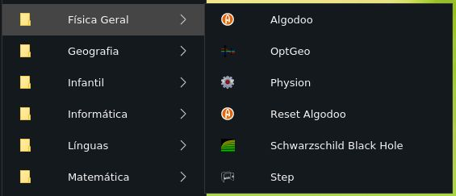

Appsedu is an package to install a lot of educational apps. You can install all apps available of recommended by the package or choose your packages and after generate the menus.

1. Install the Winunix repository. Follow the steps in:

[https://winunix.github.io/debian](https://winunix.github.io/debian)

2. If you use a package with final `-wine`, install the wine and create a prefix. Follow the steps in:

[https://ailtonbsj.github.io/running-windows-apps-on-linux-with-wine](https://ailtonbsj.github.io/running-windows-apps-on-linux-with-wine)

3. Install the educational apps you want.

Example:

```bash
sudo apt install logisim-evolution
sudo apt install physion-wine
sudo apt install celestia
sudo apt install coppelia-sim-edu
```

4. Install the `appsedu-menus` package to create the submenus of educational apps divided by discipline.

```bash
sudo apt install --no-install-recommends appsedu-menus
```

## Apps available divided by discipline





